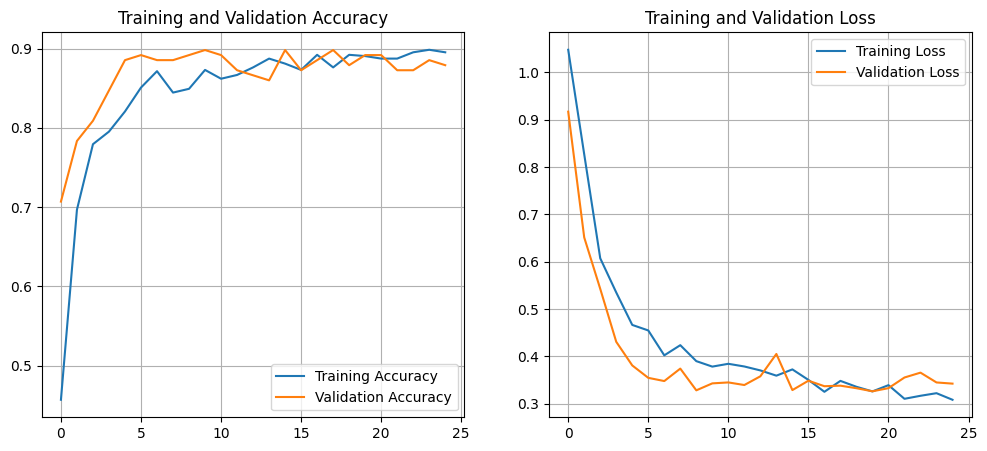
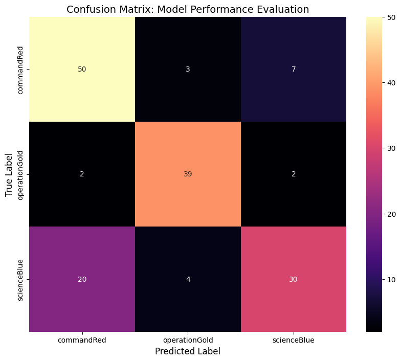
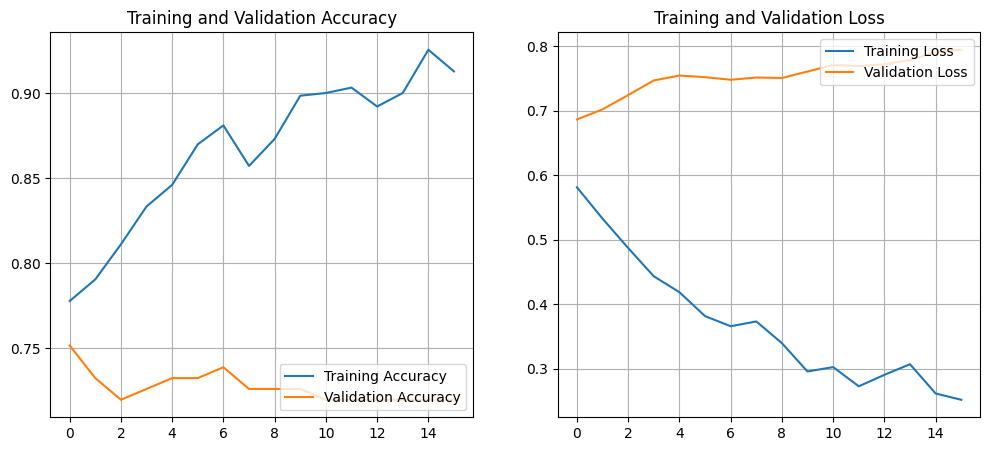
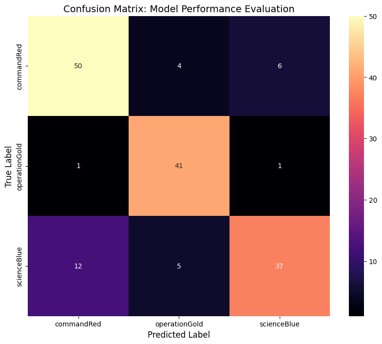
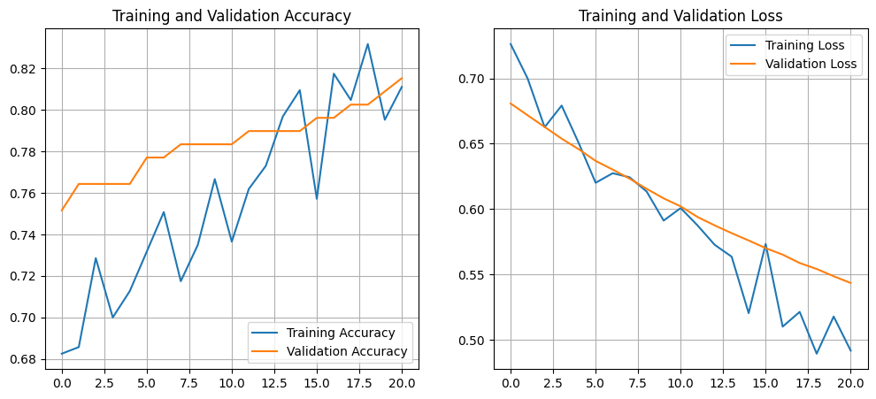

# How to Run
**Disclaimer: Deploy made using only the best method (Custom Model)**

## First method - Run on CMD
* Clone/download the project
* run `python cmdTest.py imagepath.png`
* it runs the custom model "custom_model_stclassifier.keras" by default
* you can specify a model using `python cmdTest.py imagepath.jpg --model your_model.keras`

## Second method - Run on Streamlit (website)
* Clone/download the project
* run `streamlit run app.py`

# Evaluation
**The custom model outperformed MobileNetV2 and EfficientNetB0. It is due to the small dataset I provided for this project. The model was trained with 787 images (already cleaned), with different eras of Star Trek (TOS/TNG/MOVIES) so, there might have a bit of bias.**
## Custom model
### Classification Report

| Class           | Precision | Recall | F1-score | Support |
|-----------------|-----------|--------|----------|---------|
| commandRed      | 0.83      | 0.88   | 0.85     | 60      |
| operationGold   | 0.95      | 0.95   | 0.95     | 43      |
| scienceBlue     | 0.88      | 0.81   | 0.85     | 54      |

**Accuracy:** 0.88 (157 samples)

| Average Type   | Precision | Recall | F1-score | Support |
|---------------|-----------|--------|----------|---------|
| Macro Avg     | 0.89      | 0.88   | 0.88     | 157     |
| Weighted Avg  | 0.88      | 0.88   | 0.88     | 157     |

### Confusion Matrix

### Acc/Loss curve

*****

## MobileNetV2
### Classification Report

| Class           | Precision | Recall | F1-score | Support |
|-----------------|-----------|--------|----------|---------|
| commandRed      | 0.69      | 0.83   | 0.76     | 60      |
| operationGold   | 0.85      | 0.91   | 0.88     | 43      |
| scienceBlue     | 0.77      | 0.56   | 0.65     | 54      |

**Accuracy:** 0.76 (157 samples)

| Average Type   | Precision | Recall | F1-score | Support |
|---------------|-----------|--------|----------|---------|
| Macro Avg     | 0.77      | 0.77   | 0.76     | 157     |
| Weighted Avg  | 0.76      | 0.76   | 0.75     | 157     |

### Confusion Matrix

### Acc/Loss Curve

***

## EfficientNetB0
### Classification Report

| Class           | Precision | Recall | F1-score | Support |
|-----------------|-----------|--------|----------|---------|
| commandRed      | 0.79      | 0.83   | 0.81     | 60      |
| operationGold   | 0.82      | 0.95   | 0.88     | 43      |
| scienceBlue     | 0.84      | 0.69   | 0.76     | 54      |

**Accuracy:** 0.82 (157 samples)

| Average Type   | Precision | Recall | F1-score | Support |
|---------------|-----------|--------|----------|---------|
| Macro Avg     | 0.82      | 0.82   | 0.82     | 157     |
| Weighted Avg  | 0.82      | 0.82   | 0.81     | 157     |

### Confusion Matrix

### Acc/Loss Curve

# Validation
## K-Fold Cross-Validation Results (k=5)
**Average performance across 5 folds of each model**

| Model           | Mean Accuracy  | Std Dev | 
|-----------------|-----------|--------|
| **Custom CNN**      | 85.90%       | ± 1.69%   | 
| **MobileNetV2**  | 75.73%      | ± 2.07%   | 
| **EfficientNetB0**     | 83.99%      | ± 4.87%   | 

# Troubleshooting
* imgs in wrong extension and different size, some imgs are corrupted
    * remove every ext except png and jpg
    * make everything 128x128
    * try to open img
* target - class names gets messy
    * save it
* gotta know if imgs are right
    * visualize pixel range and shape
* classes are imbalanced
    * data augmentation
* 2 dense layers not good
    * using 3: 32 - 64 - 128
* confusion matrix traceback due to data preprocessing
    * gotta handle onehotencode and sparselabel
* mobilenet tracebok - not downloading weights
    * initialize it locally
* mobilenet unfreezing layers 
    * 20 layers 
* mobielnet slightily overffiting
    * increase dropout to .5
    * l2 regularization
* too many test with epochs
    * callback to stop when its peak
* efficientnetb0 data problem - it excepts pixel range [0, 255]
    * do not manual scale
    * it has own scaling
* efficientnetb0 memorizing noising, high variance
    * apply gaussiannoise layer
* ficcientnet underfitting
    * increase unfreezed layers
* model guessing gold for blue and vice-verse
    * fix class_names order in deploy scripts
* predictions different from deployu to model
    * standardize imgs uploaded
* confidence value too small
    * convert them to percentage *100
* add args to cmd deploy
    * img and model (maybe others)
* file upload showing 200mb due to st.file_uploader
    * change it locally with .streamlit
* UX too 'technical'
    * create a map for names and colors
* cant change color with st.progress
    * use markdown with html/css inline